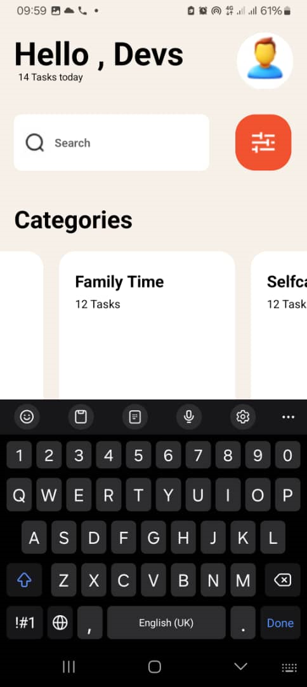

# REACT-NATIVE ASSIGNMENT 3.
## ASSIGNMENT DESCRIPTION:
- I was recreated the design in the UI mockup. I imported and used core components such as 'View', 'Text', 'ScrollView', 'TextInput', 'StyleSheet', and  'FlatList' for rendering lists of tasks. I also used  'Image` for icons and displaying images. I included categories like Exercise, Study, Code, Cook, Selfcare, Quiet time, family time and gardening. I also created a list of 15 ongoing tasks. The style of the application closely matches the provided UI design.
##  COMPONENT USAGE:
  ### • View
  - In this assignment, the 'View' components were used to structure and organize the layout. They were used to wrap the entire content within a scrollable container. They also grouped elements such as the greeting text and profile image, or the search bar and filter icon.The view components were used to create and style individual sections, like categories and ongoing tasks, to ensure a cohesive and visually appealing UI.
  ### • ScrollView
  - The 'ScrollView' component enables vertical scrolling through the app by wrapping the entire content and also accommodating content that exceed the screen height. It also ensures that all components within the app can be viewed in a single scrollable layout.
  ### • FlatList
  - The 'FlatList' component was used to efficiently render lists. It was used to display a horizontal list of categories, each with a title and image, allowing for horizontal scrolling. It was also used to render a vertical list of ongoing tasks, providing a scrollable list of items.
  ### • Image
  - The 'Image' component was used to show a profile picture within a circular View. It was also used to include various icons, such as the search icon and filter icon. Using the image component, visual elements were added to the categories flatlist.
  ### • StylesSheet:
  - The 'StyleSheet' Component defines all styles used in the app, hence, ensuring consistency. It provides customized styling for different components, such as containers, text, and images. It also allows for the reuse of style objects that can be applied to multiple components.
  ### • Text
  - The 'Text' component was used to show various pieces of text, such as headings, task descriptions, and category names.
  ### • TextInput
  - The 'TextInput' component was used to create a search bar that allowed for user input.
## PROJECT SCREENSHOTS:
### Profile Section and General Layout

This is the profile section of the app where the user can see their profile picture and greeting.

### Search and Filter Section

This section includes the search bar and filter options for finding specific tasks.

### Ongoing Task Section

This section displays a list of ongoing tasks that the user is currently working on.
